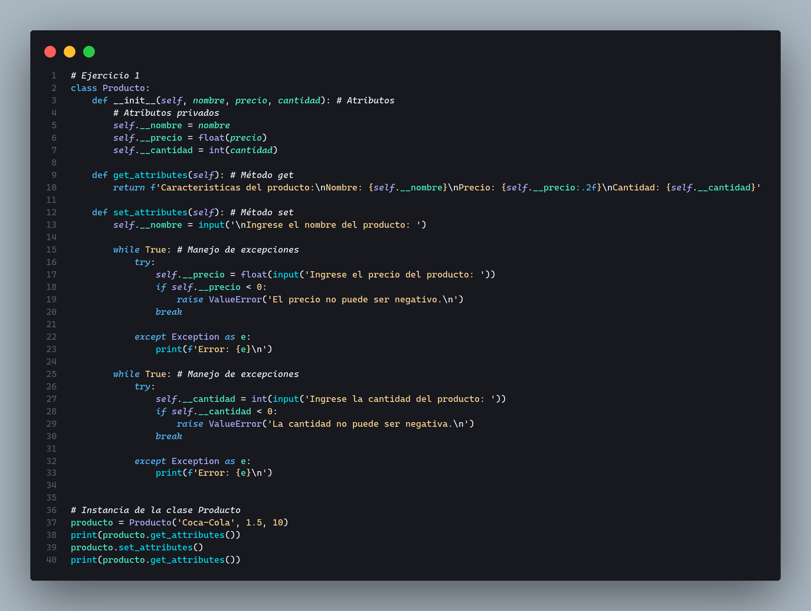
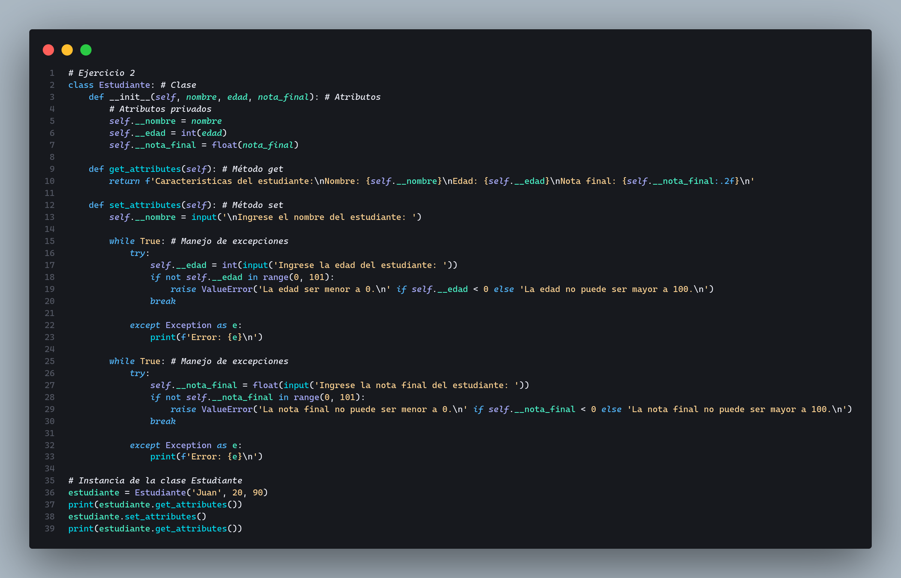
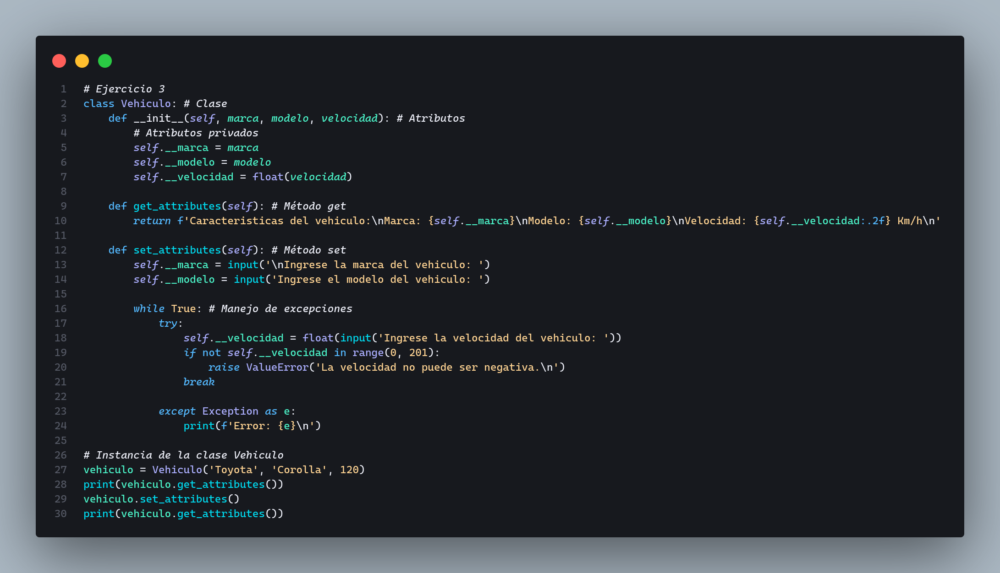
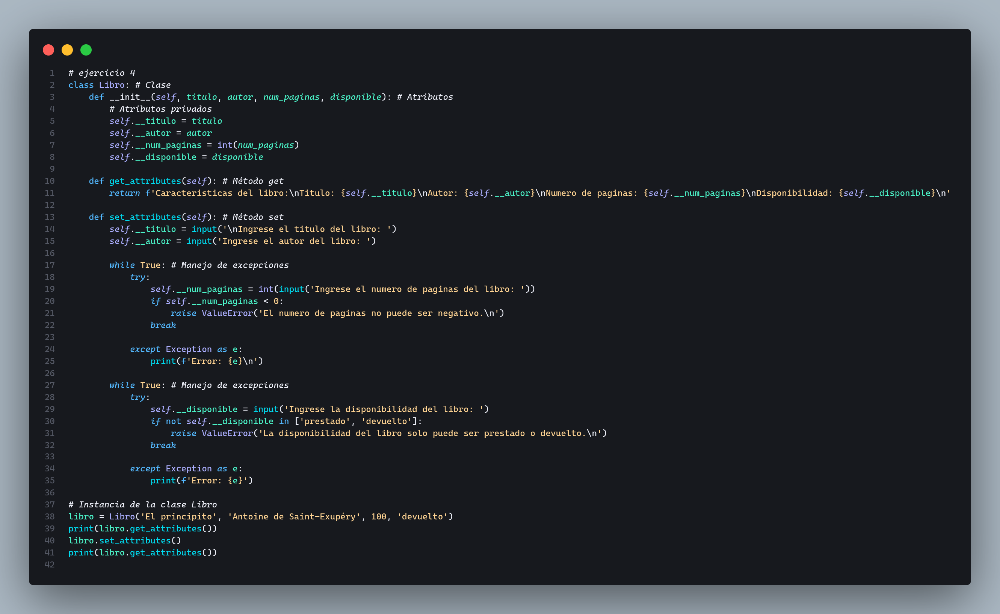
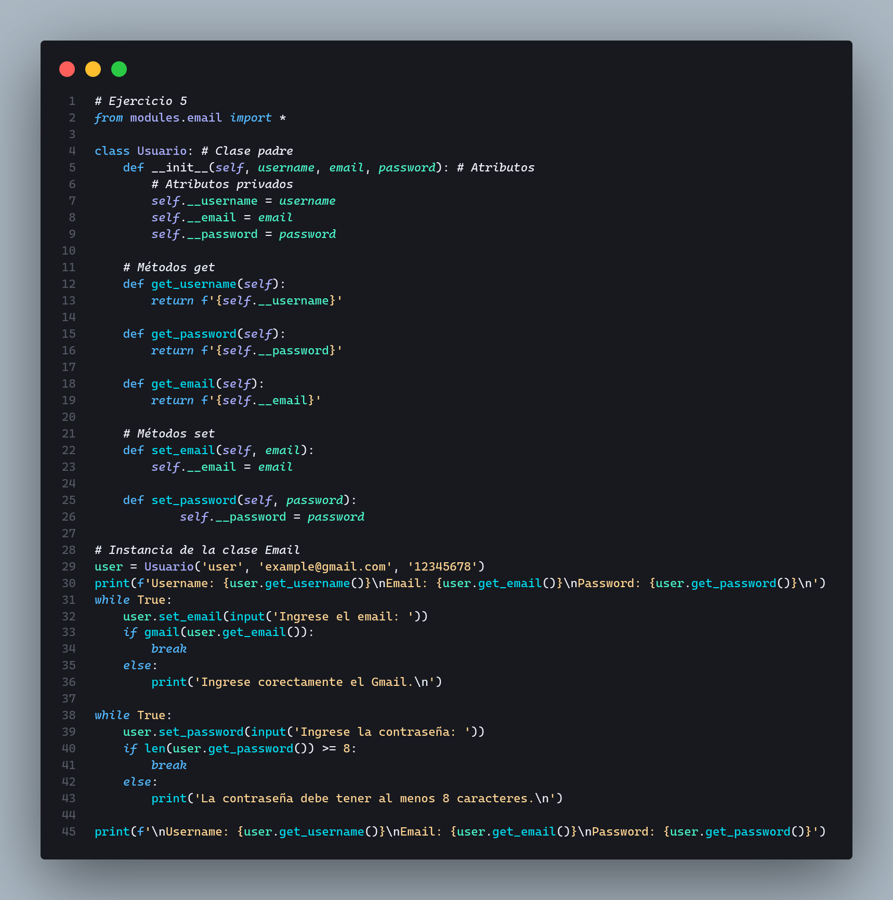

# Abstraccin y Encapsulamiento en el POO
Se estan realizando una serie de ejercicios en los que se usa lo mostrado en las diapositivas.

## Abstracción
### ¿Qué la Abstracción?
La Abstracción es un concepto fundamental en la POO que se refiere al proceso de simplificar sistemas complejos al reducirlos a sus características esenciales.

  
<b>Pmenu.py</b>

  

  
<b>Pmenu.py</b>

  

  
<b>Pmenu.py</b>

  

  
<b>Pmenu.py</b>

  

  
<b>Pmenu.py</b>

  

